## NeuroMLlite: a common framework for reading/writing/generating network specifications

[](https://github.com/NeuroML/NeuroMLlite/actions/workflows/ci.yml)
[](https://pypi.org/project/NeuroMLlite/)
[](https://pypi.org/project/NeuroMLlite/)
[](https://github.com/NeuroML/NeuroMLlite/blob/master/LICENSE.lesser)
[](https://github.com/NeuroML/NeuroMLlite/pulls)
[](https://github.com/NeuroML/NeuroMLlite/issues)
[](https://github.com/NeuroML)
[](https://twitter.com/NeuroML)


Work in progress. This will develop in to a framework for more portable, concise network specifications which will form an important part of [NeuroML v3](https://docs.neuroml.org/NeuroMLOrg/History.html#the-future).

For some more background to this package see here: https://github.com/NeuroML/NetworkShorthand.

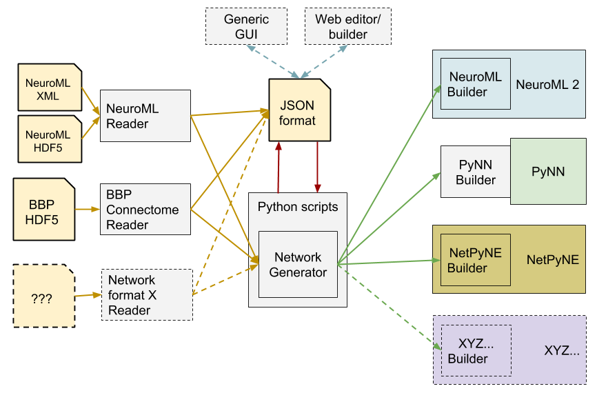


## Examples
The best way to see the currently proposed structure is to look at the examples

### Ex. 1: Simple network, 2 populations & projection
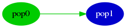

[JSON](examples/Example1_TestNetwork.json) | [Python script](examples/Example1.py)

Can be exported to:
- **NeuroML 2** (XML or HDF5 format)
- **Graph** (see above) 

### Ex. 2: Simple network, 2 populations, projection & inputs
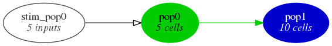

[JSON](examples/Example2_TestNetwork.json) | [Python script](examples/Example2.py) | [Generated NeuroML2](examples/Example2_TestNetwork.net.nml)

Can be exported to:
- **NeuroML 2** (XML or HDF5 format)
- **Graph** (see above) 

### Ex. 3: As above, with simulation specification

[JSON for network](examples/Example3_Network.json) | [JSON for simulation](examples/SimExample3.json) | [Python script](examples/Example3.py) | [Generated NeuroML2](examples/Example3_Network.net.nml) | [Generated LEMS](examples/LEMS_SimExample3.xml)

Can be exported to:
- **NeuroML 2** (XML or HDF5 format)
- **Graph** (see Ex2) 

Can be simulated using:
- **NetPyNE**
- **jNeuroML**
- **NEURON** generated from **jNeuroML**
- **NetPyNE** generated from **jNeuroML**


### Ex. 4: A network with PyNN cells & inputs
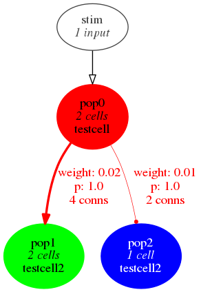

[JSON](examples/Example4_PyNN.json) | [Python script](examples/Example4.py) | [Generated NeuroML2](examples/Example4_PyNN.net.nml) 

Can be exported to:
- **NeuroML 2** (XML or HDF5 format)
- **Graph** (see above) 

Can be simulated using:
- **NEST** via **PyNN**
- **NEURON** via **PyNN**
- **Brian** via **PyNN**
- **jNeuroML**
- **NEURON** generated from **jNeuroML**
- **NetPyNE** generated from **jNeuroML**


### Ex. 5: A network with the Blue Brain Project connectivity data
 

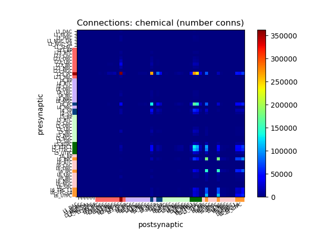  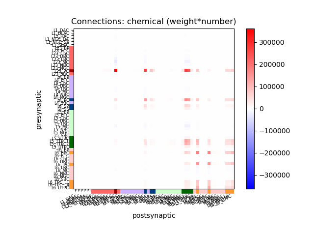 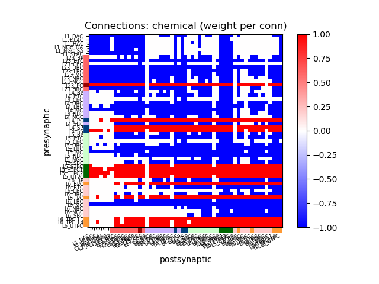 

[JSON](examples/BBP_5percent.json) | [Python script](examples/Example5.py) 

Can be exported to:
- **NeuroML 2** (XML or HDF5 format)
- **Graph** (see above) 
- **Matrix** (see above) 

Can be simulated using:
- **NetPyNE**

### Ex. 6: A network based on Potjans and Diesmann 2014 (work in progress)
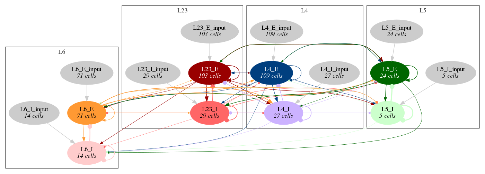 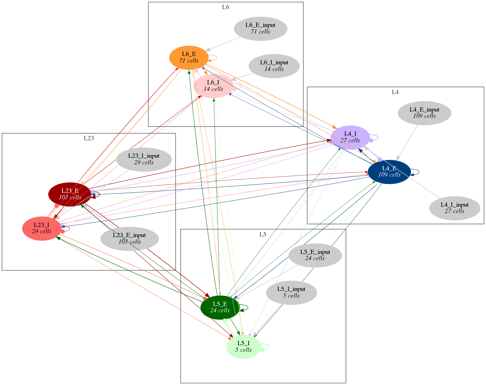  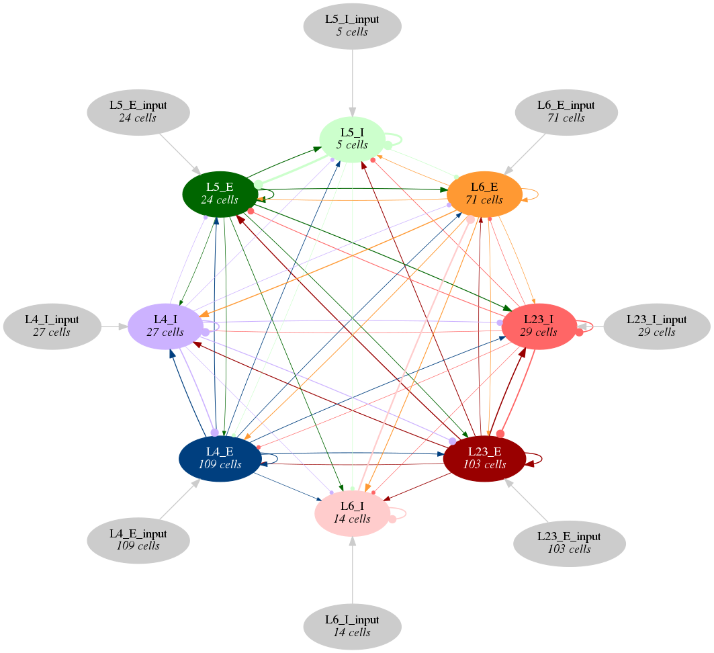 
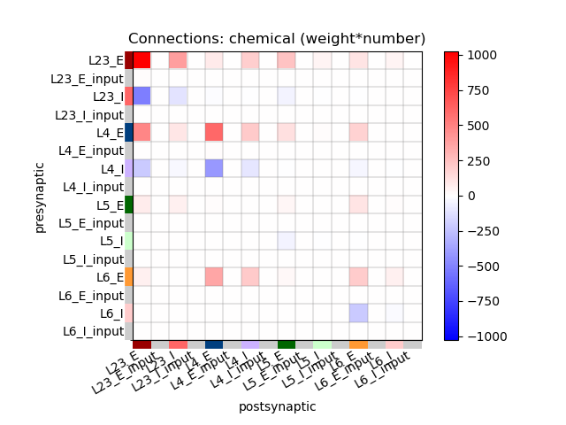 

[JSON](examples/Example6_PyNN.json) | [Python script](examples/Example6.py) | [Generated NeuroML2](examples/Example6_PyNN.net.nml) 

Can be exported to:
- **NeuroML 2** (XML or HDF5 format)
- **Graph** (see above) 
- **Matrix** (see above) 

### Ex. 7: A network based on Brunel 2000 (work in progress)
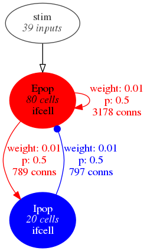 

[JSON](examples/Example7_Brunel2000.json) | [Python script](examples/Example7.py) | [Generated NeuroML2](examples/Example7_Brunel2000.net.nml) 

Can be exported to:
- **NeuroML 2** (XML or HDF5 format)
- **Graph** (see above) 

Can be simulated using:
- **jNeuroML**

## Installation & usage

Installation of the basic framework should be fairly straightforward:

```
git clone https://github.com/NeuroML/NeuroMLlite.git
cd NeuroMLlite
sudo python setup.py install
```

Then simple examples can be run:

```
cd examples
python Example1.py  #  Generates the JSON representation of the network (console & save to file)
```

To generate the NeuroML 2 version of the network, first install pyNeuroML, then use the -nml flag:
```
sudo pip install pyNeuroML
python Example2.py -nml       # Saves the network structure to a *net.nml XML file
```

Other options (which will require [Neuron](https://neuron.yale.edu/neuron/), [NetPyNE](http://www.netpyne.org/), 
[PyNN](http://neuralensemble.org/PyNN/), [NEST](http://www.nest-simulator.org/), [Brain](http://briansimulator.org/) etc. to be installed) include:

```
python Example4.py -jnml       # Generate NeuroML2 & LEMS simulation & run using jNeuroML
python Example4.py -jnmlnrn    # Generate NeuroML2 & LEMS simulation, use jNeuroML to generate Neuron code (py/hoc/mod), then run in Neuron
python Example4.py -jnmlnrn    # Generate NeuroML2 & LEMS simulation, use jNeuroML to generate NetPyNE code (py/hoc/mod), then run in NetPyNE
python Example4.py -netpyne    # Generate network in NetPyNE directly & run simulation
python Example4.py -pynnnrn    # Generate network in PyNN, run using simulator Neuron
python Example4.py -pynnnest   # Generate network in PyNN, run using simulator NEST
python Example4.py -pynnbrian  # Generate network in PyNN, run using simulator Brian
```

Graphs of the network structure can be generated at many levels of detail (1-6) and 
laid out using [GraphViz](http://graphviz.org/) engines (d - dot (default); c - circo;
 n - neato; f - fdp). See above images for generated examples.

    python Example6.py -graph3d
    python Example6.py -graph2f
    python Example6.py -graph1n


## Other examples

NeuroMLlite is being tested/used in the following repositories on OSB:

- [Wilson & Cowan](https://github.com/OpenSourceBrain/WilsonCowan/blob/master/NeuroML2/GenerateNetworkOverview.py)
- [Mejias et al. 2016](https://github.com/OpenSourceBrain/MejiasEtAl2016/blob/master/NeuroML2/GenerateNeuroMLlite.py)
- [Pospischil et al. 2008](https://github.com/OpenSourceBrain/PospischilEtAl2008/tree/master/NeuroML2/cells/summary)
- [Bezaire et al. 2016](https://github.com/mbezaire/ca1/tree/development/NeuroML2/network/nmllite)
- [PING networks](https://github.com/OpenSourceBrain/PINGnets/tree/master/NeuroML2) 
- [PsyNeuLink tests](https://github.com/OpenSourceBrain/PsyNeuLinkShowcase/tree/master/NeuroML2)
- [OpenWorm - c302](https://github.com/openworm/c302/tree/master/examples/parametersweep)


