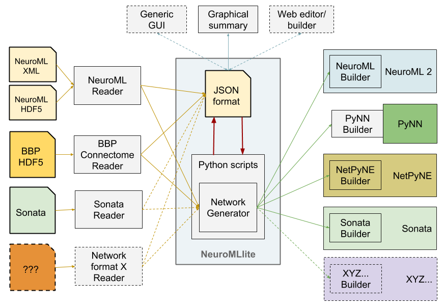

### Proposal for common framework for reading/writing/generating network specifications

The best way to see the currently proposed structure is to look at the examples

#### Ex. 1: Simple network, 2 populations & projection
[JSON](Example1_TestNetwork.json) | [Python script](Example1.py)

Can be exported to:
- **NeuroML 2** (XML or HDF5 format)

#### Ex. 2: Simple network, 2 populations, projection & inputs
[JSON](Example2_TestNetwork.json) | [Python script](Example2.py) | [Generated NeuroML2](Example2_TestNetwork.net.nml)

Can be exported to:
- **NeuroML 2** (XML or HDF5 format)

#### Ex. 3: As above, with simulation specification
[JSON for network](Example3_Network.json) | [JSON for simulation](SimExample3.json) | [Python script](Example3.py) | [Generated NeuroML2](Example3_Network.net.nml) | [Generated LEMS](LEMS_SimExample3.xml)

Can be exported to:
- **NeuroML 2** (XML or HDF5 format)

Can be simulated using:
- **NetPyNE**
- **jNeuroML**
- **NEURON** generated from **jNeuroML**
- **NetPyNE** generated from **jNeuroML**

#### Ex. 4: A network with PyNN cells & inputs
[JSON](Example4_PyNN.json) | [Python script](Example4.py) | [Generated NeuroML2](Example4_PyNN.net.nml) 

Can be exported to:
- **NeuroML 2** (XML or HDF5 format)

Can be simulated using:
- **NEST** via **PyNN**
- **NEURON** via **PyNN**
- **Brian** via **PyNN**
- **jNeuroML**
- **NEURON** generated from **jNeuroML**
- **NetPyNE** generated from **jNeuroML**

#### Ex. 5: A network with the Blue Brain Project connectivity data 
[JSON](BBP_5percent.json) | [Python script](Example5.py) 

Can be exported to:
- **NeuroML 2** (XML or HDF5 format)

Can be simulated using:
- **NetPyNE**
